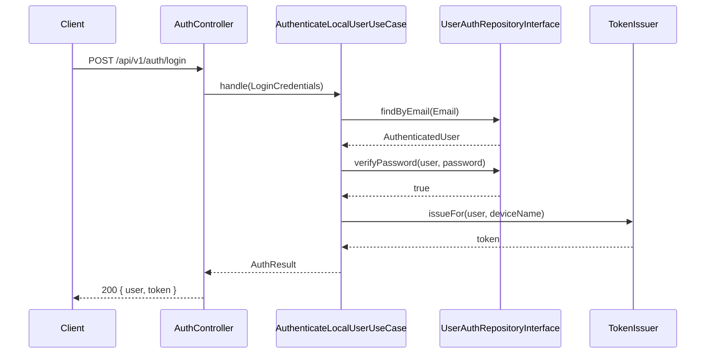

# Architecture

## Principes

Le projet suit une architecture **modulaire (DDD) + hexagonale légère** :

- Chaque module métier (`Modules/Auth`, `Modules/Users`, `Modules/Dashboard`, ...) est **autonome** :
  il possède son propre Domain, Application, Infrastructure, ses routes, migrations, tests.
- Le **Domain** ne dépend de rien (ni Laravel, ni Eloquent) : entités, value objects, exceptions métier, interfaces de repository (*ports*).
- L'**Application** orchestre les cas d'usage (*use cases*) en ne dépendant que d'interfaces (ports).
- L'**Infrastructure** implémente les ports (repositories Eloquent, contrôleurs HTTP, guards CAS/LDAP, ...) — c'est la seule couche qui connaît Laravel.

```
Modules/Auth/
├── Domain/            # Cœur métier, aucune dépendance Laravel
│   ├── Entities/
│   ├── ValueObjects/
│   ├── Repositories/  # Interfaces (ports)
│   └── Exceptions/
├── Application/       # Cas d'usage + DTO + ports de sortie
│   ├── UseCases/
│   ├── DTO/
│   └── Ports/
├── Infrastructure/     # Adapters : Eloquent, HTTP, Guards, Providers
│   ├── Persistence/
│   ├── Http/
│   ├── Security/
│   └── Providers/
├── Routes/
├── Database/
└── Tests/
```

## Pourquoi hexagonal "léger" ?

Une architecture hexagonale stricte impose de tout passer par des ports/adapters,
y compris la persistance simple. Pour rester pragmatique sur un projet Laravel :

- Les **règles métier importantes** (authentification, validation d'email, règles de rôle...)
  vivent dans le Domain et sont testées unitairement, sans base de données.
- Les opérations **CRUD simples** passent par un repository Eloquent qui implémente
  l'interface du domaine — le contrat est respecté, sans sur-ingénierie inutile.

## Communication entre modules

Un module ne doit **pas** dépendre de la couche Infrastructure d'un autre module,
sauf pour le modèle Eloquent partagé `UserModel` (module `Users`), qui représente
l'utilisateur physique en base — point d'ancrage commun à `Auth` et `Dashboard`.
À terme, ce partage peut être remplacé par des événements de domaine
(`UserRegistered`, `UserDeactivated`, ...) pour un découplage encore plus strict.

## Diagramme de séquence — connexion locale


